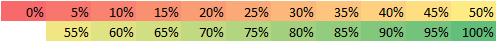

# S4-Suggestions

## Motivation

Why to manage suggestions in GitHub?

- suggestions can be linked together if related
- discussion can be next to suggestion
- we can categorize suggestions

## Status

### Overall

added: 385-421, 347

last update: 2021-03-28 22:00 CEST

### 2021 goal

first suggestion ID: 348

added: 385-421

last update: 2021-03-28 22:00 CEST

### Colors

## How to add Discord Suggestion?

1. go to [Issues]
2. click [`New Issue` button]
3. click on `Get started` next to `Suggestion`

### How to fill it in?

From discord:

1. ID `411`
2. date (I prefer `yyyy-mm-dd` format) `2021-03-22`
3. text `Arena change: ...`
4. link
5. title (prefix with #ID - `#411 - `
6. labels

#### Titles

- new hero: `#<ID> - New hero: <name>`

#### Labels

- hero
- arena
- trophies

## Can we add non-discord suggestion

No. At this stage not yet

[Issues]: https://github.com/Betlista/S4-Suggestions/issues
[`New Issue` button]: https://github.com/Betlista/S4-Suggestions/issues/new/choose
